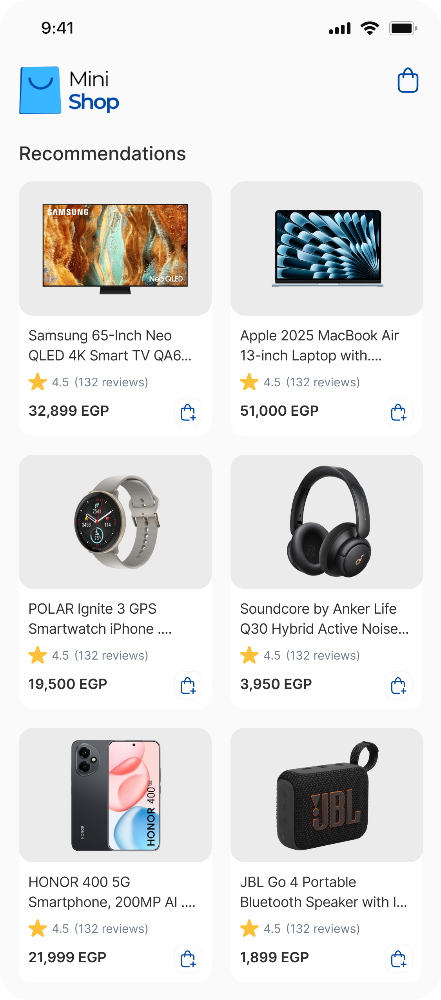
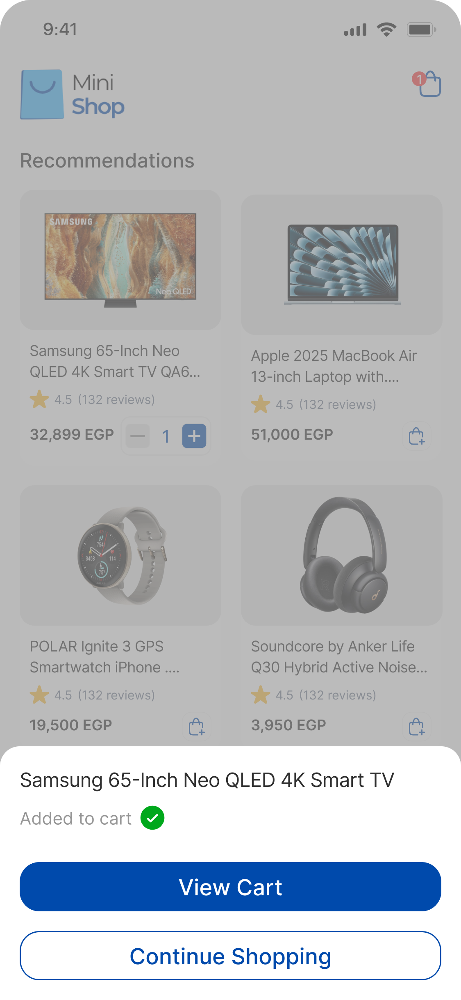
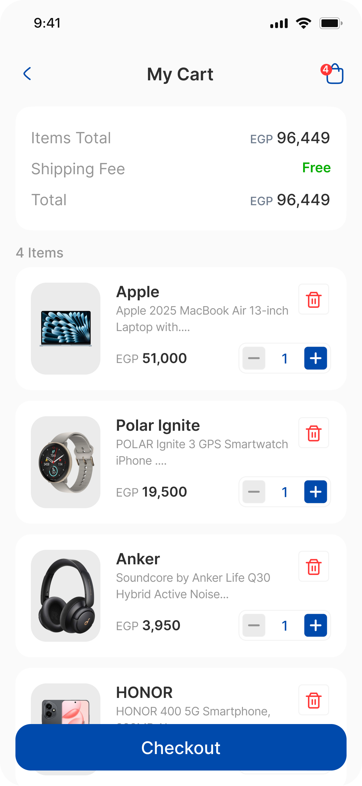

# Mini Shop Provider API Exam

## Introduction

This exam tests your ability to build a functional Flutter shopping application using **Provider** for state management and **REST API** integration.

**Design File (Figma):**
[View Design on Figma](https://www.figma.com/design/EkIW6iEZpdvZ0jIWnRjOvz/Route-Flutter)

---

## Required Screens

The application consists of two main screens:

1.  **Catalog Screen**
2.  **Cart Screen**

---

### 1. Catalog Screen

**Functionality:**

- Fetch products from the API:
  https://fakestoreapi.com/products

- Display a list/grid of products showing:
  - Product Image
  - Product Title
  - Price

- **Add to Cart**: Each item must have a button to add it to the cart.

- **AppBar**: Must contain a Cart icon with a **badge** showing the current number of items in the cart.

**States to Handle:**

- **Loading State**: Show a loading indicator while fetching data.
- **Error State**: Show a user-friendly error message if the API call fails.

---

### 2. Cart Screen

**Functionality:**

- Display **only** the products selected by the user.

- **Quantity Controls**: Each item must allow the user to:
  - Increase quantity
  - Decrease quantity
  - Remove item completely

- **Total Price**: Display the calculated total price at the bottom, updating automatically as items are modified.

- **Checkout Button**: UI only (no API integration required).

---

## Technical Requirements

**State Management:**

- Must use **Provider** + **ChangeNotifier**.
- **Logic Separation**: Keep business logic separate from UI code.
- **Context Usage**:
  - Use `context.read` inside buttons/callbacks.
  - Use `context.watch` only where UI updates are needed.
  - Use `Consumer` for optimizing rebuilds where appropriate.

**API Integration:**

- Use **Dio** or **http** package.
- Create a dedicated `ApiService` class.
- Properly parse JSON responses into Dart models.

**Data Persistence:**

- The Cart should be local (in-memory or local storage if preferred, but not API based).

---

## Bonus (Optional)

- Implement **Pull to Refresh** on the Catalog screen.
- Show a **Snackbar** when an item is successfully added to the cart.
- Display a specific **Empty Cart UI** when there are no items.
- Add smooth **Animations** for interactions.

---

## UI Preview

|             Catalog Home             |                       Add to Cart                        |             Cart Screen              |
| :----------------------------------: | :------------------------------------------------------: | :----------------------------------: |
|  |  |  |
